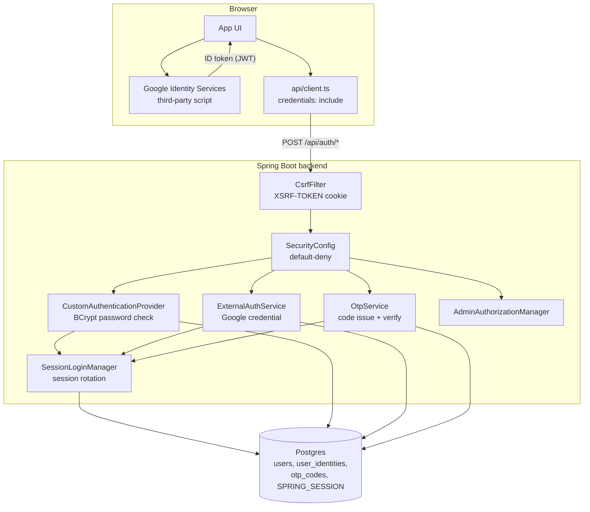
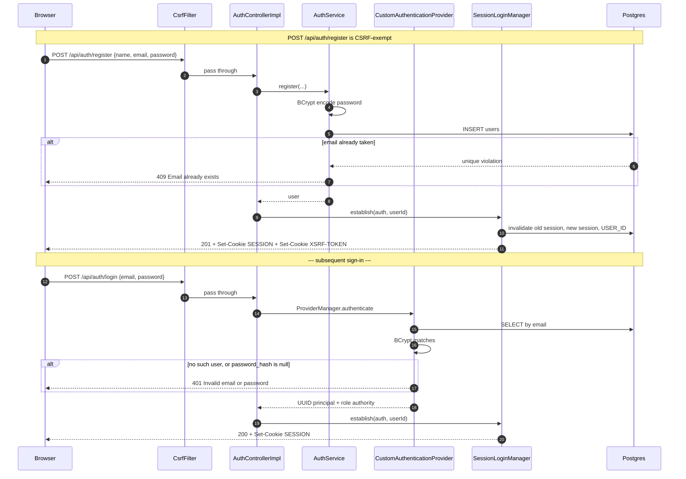
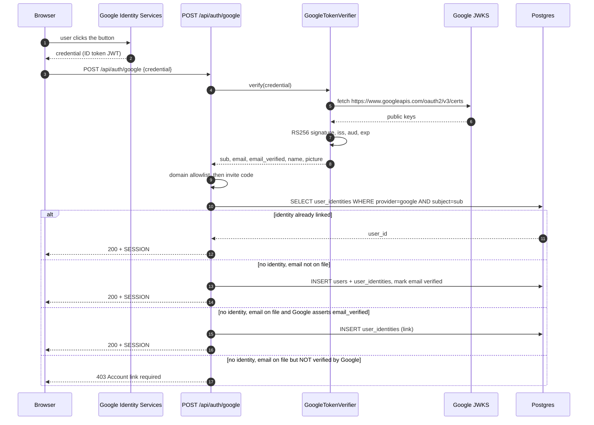
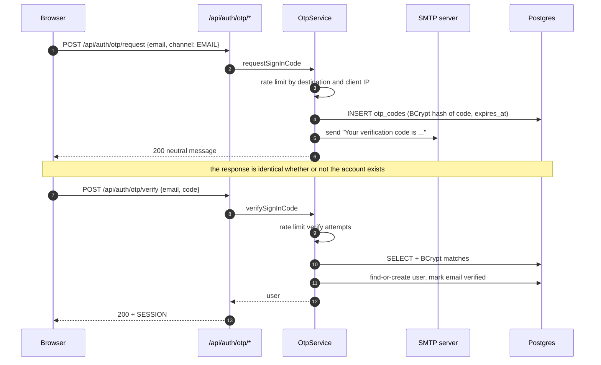
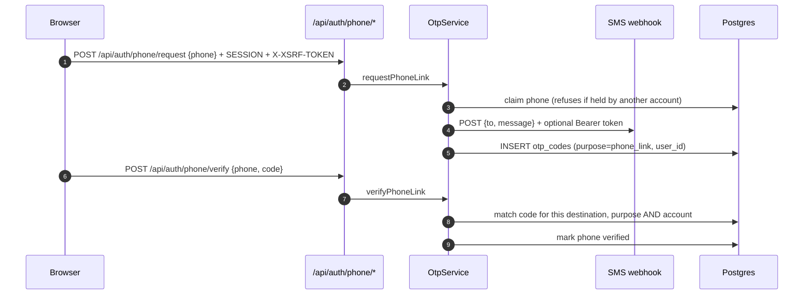
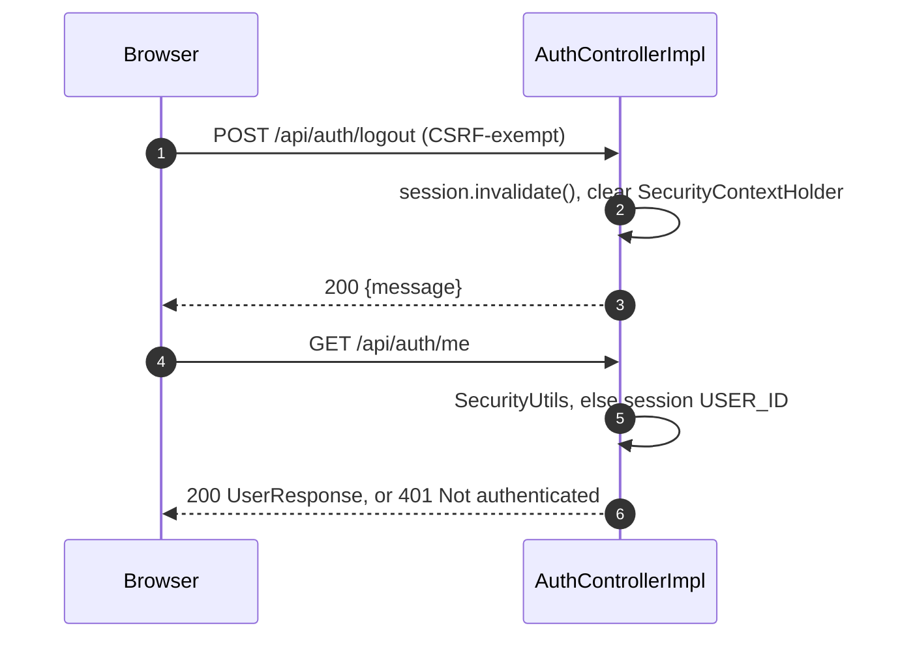

# Authentication Architecture

How sign-in and sign-up actually work in this repository: the request paths, the session
that results, and every external system the backend contacts to prove identity.

Diagrams are Mermaid — render in any Mermaid-capable viewer or the GitHub preview.

**Everything in this document describes shipped code.** Where something is deliberately absent
it says so, rather than describing an intended design.

Related documents:

- [AUTH_CLIENT_GUIDE.md](AUTH_CLIENT_GUIDE.md) — the integration contract for a consuming site
- [AUTH_INTEGRATION.md](AUTH_INTEGRATION.md) — REST reference for password/register/me/logout
- [API_ACCESS_CONTROL.md](API_ACCESS_CONTROL.md) — `X-API-Key` machine auth, a separate credential

---

## 1. The one idea

There is no application JWT. Every sign-in method ends at the same place: `SessionLoginManager.establish(...)`, which rotates the HTTP session and writes the `SESSION` cookie. The application credential is a session cookie, full stop.

```
proved identity  ->  SessionLoginManager.establish()  ->  SESSION cookie  ->  every later request
```

Because all four methods funnel through one method, a session is indistinguishable regardless of
how it was obtained, and no sign-in path can quietly establish a weaker credential than another.

The external identity provider is used for exactly one thing: proving who the user is. It never
issues an application credential, and the browser never holds a provider token it can replay.

### Verified security posture

| Control | Where |
|---|---|
Default-deny routing | `SecurityConfig.java:221` — `.anyRequest().authenticated()`, every route classified |
CSRF | `SecurityConfig.java:125` — cookie-backed `XSRF-TOKEN`, echoed as `X-XSRF-TOKEN` |
Session fixation defense | `SessionLoginManager.java:40-43` — old session invalidated before the new one is created |
Persistent sessions | `spring-boot-starter-session-jdbc` + `SPRING_SESSION` (Flyway **V87**), 24h |
One session per user | `SecurityConfig.java:273` — `maximumSessions(1)` |
Admin is ADMIN-only | `AdminAuthorizationManager`; a `PROJECT` API key can never satisfy it |
Password storage | BCrypt via `PasswordEncoder` — `PasswordEncoderConfig.java:20` |
OTP code storage | BCrypt, never plaintext — `OtpServiceImpl.java:193` |

---

## 2. System overview



---

## 3. Sign-in / sign-up sequences

### 3a. Email + password — register, then login

`POST /api/auth/register` creates the account and signs in; `POST /api/auth/login` signs in an
existing one. Both are CSRF-exempt because no session exists yet.



`CustomAuthenticationProvider.java:38-45` rejects a null or blank `password_hash` outright. That
is what makes a Google-only or OTP-only account unable to attempt a password login, rather than
falling through to a matcher against a null hash.

The principal is a bare `UUID` plus a single role authority
(`UserAuthentication.java:24-27`), so every sign-in method yields an identical principal shape.

### 3b. Google sign-in — the only Google entry point

The browser gets an ID token from Google Identity Services and posts it. The backend verifies
that token against Google's public keys and never calls a Google token endpoint, so no client
secret and no redirect URI exist in this design.



The four outcomes are decided in `ExternalAuthServiceImpl.java:70-103`.

Two details that are load-bearing:

- **Identity is keyed on Google's `sub`, never on email.** `UserIdentityDao.findByProviderAndSubject`
  looks up `(provider, subject)`. Email changes at Google therefore do not orphan an account.
- **Linking requires a Google-asserted verified email.** If the address is already on file and
  Google does not assert `email_verified`, the server refuses to attach the credential. Without
  this, anyone able to register an address elsewhere could claim the pre-existing account. The
  `403` carries no email field, so a client cannot pre-fill which account needs linking.

Domain and invite-code checks run *before* any lookup, and a client-supplied `hd` can only
narrow the allowlist, never widen it (`ExternalAuthServiceImpl.java:142-151`).

### 3c. Email OTP (magic code)



`OtpServiceImpl.requestSignInCode` returns a deliberately identical response whether or not the
address is registered, so the endpoint cannot be used to enumerate accounts. When no SMTP host is
configured the code is written to the log instead, which keeps the flow usable locally.

### 3d. Phone linking (post sign-in, requires a session)

`POST /api/auth/phone/request` and `/phone/verify` are **not** sign-in endpoints — they require
an existing session and are not CSRF-exempt.



SMS **sign-in** is only offered for a number some account has already confirmed
(`OtpServiceImpl.java:168-169`). Requesting a code proves nothing about ownership, so allowing a
code to an unclaimed number would let anyone who learns a number sign in as its holder.

A Google-reported `phone_number` is recorded but deliberately **never** marked verified
(`ExternalAuthServiceImpl.java:112`): Google does not prove control of a number through an OAuth
assertion the way it proves an address, so the number stays unusable until the user completes the
SMS check.

### 3e. Sign-out and current user



---

## 4. Frontend flow

### 4a. This repository's own frontend

The SPA in `frontend/` implements **email + password only**. There is deliberately no Google
button, no OTP input, and no phone-link screen — those are consumed by *other* sites, and
`AGENTS.md` forbids shipping an API client method with no live caller.

| Concern | Implementation |
|---|---|
Auth state | `context/AuthContext.tsx` — `AuthProvider` + `useAuth()` |
Route guard | `navigation/AppNavigator.tsx:9-14` `RequireAuth` |
Sign-in screen | `screens/LoginScreen.tsx` |
Sign-up screen | `screens/SignupScreen.tsx` |
API client | `api/client.ts` |
Error mapping | `api/errors.ts` |

Session bootstrap on load (`AuthContext.tsx:84-111`):

1. Read any cached user from `localStorage` and show it immediately to avoid a flash.
2. `GET /api/health` — if this fails, render `BackendErrorScreen` rather than a login form.
3. `GET /api/auth/me` — the cookie is the real authority. Overwrite or clear the cache.

Sign-in (`AuthContext.tsx:117-135`):

1. `POST /api/auth/login`.
2. **Re-fetch `/api/auth/me` before rendering.** The login response does not carry every field
   the app needs, and the `Set-Cookie` has only just landed.
3. Persist to `localStorage`, clear the error, navigate.

CSRF is handled centrally in `api/client.ts:68-84`: the `XSRF-TOKEN` cookie is read and echoed as
`X-XSRF-TOKEN` on `POST`/`PUT`/`PATCH`/`DELETE`. Every request sets `credentials: 'include'`
(`client.ts:102-107`). A `401` anywhere dispatches a `platform:unauthorized` event
(`client.ts:119-121`) that the provider listens for and turns into a sign-out
(`AuthContext.tsx:187-193`), so an expired session cannot leave the UI in a half-authenticated state.

`FeatureFlagsContext` waits for `authLoading` to settle before fetching flags, so feature-flag
requests are not fired before the session cookie exists.

### 4b. Consuming sites (the multi-site case)

Any number of separate sites share these endpoints. `POST /api/auth/google` is
**origin-agnostic** — the backend verifies a signed token and never inspects which site sent it —
so there is nothing per-site to change in the request path.

Per site, the only requirements are:

1. **Reuse the same Web OAuth client id.** The token audience is compared to one configured value
   as an exact string (`GoogleTokenVerifierImpl.java:61-62`), so every site must present the
   *identical* client id. Two clients in the same Google Cloud project still yield two different
   `aud` claims, and the second site's tokens are rejected. One client carries many origins.
2. That origin in **Authorized JavaScript origins**. No redirect URI is needed.
3. That origin in the backend CORS allowlist (`SecurityConfig.java:146-152`) — otherwise the browser
   blocks the response even though the request reached the server.
4. `VITE_GOOGLE_CLIENT_ID` exposed to the browser. Never a client secret.

Supporting several distinct client ids would need a backend change: accept a set of audiences and
configure them as a comma-separated list. That is the cleanest way to relax this if a site must
own its own client.

A complete copy-paste integration is in
[AUTH_CLIENT_GUIDE.md section 6g](AUTH_CLIENT_GUIDE.md#6g-complete-working-example).

---

## 5. External systems

Every outbound call the authentication path can make.

| System | Endpoint | When | Credential | Failure behaviour |
|---|---|---|---|---|
Google JWKS | `https://www.googleapis.com/oauth2/v3/certs` | Verifying a Google ID token | none — public keys | `400 Invalid Google credential` |
SMTP server | `spring.mail.host` | Delivering an email OTP | `spring.mail.username` / `password` | Code is logged instead; flow still completes locally |
SMS provider | `app.otp.sms-provider-url` | Delivering an SMS OTP | optional `Bearer` token | Code is logged instead |

Notes:

- **Google's token endpoint is never called.** `oauth2.googleapis.com/token` appears in this
  codebase only in `FcmNotificationChannelImpl` for browser push notifications, which is
  unrelated to sign-in. Google sign-in needs no client secret precisely because no code exchange
  happens.
- **Neither delivery provider is required to boot.** Both degrade to logging the code, so the OTP
  flow is testable with no external account.
- **Supabase is storage only.** `SUPABASE_URL` / `SUPABASE_SERVICE_KEY` / `SUPABASE_BUCKET` back
  file storage. Supabase Auth is not used and there is no `supabase-js` dependency in the frontend.
- Outbound calls unrelated to sign-in — Google Books, Open Library, GitHub, LeetCode, Brave/Tavily
  search, OpenStreetMap Nominatim, ipapi.co, FCM — are outside this document.

---

## 6. Component map (as shipped)

| Concern | Interface | Implementation |
|---|---|---|
HTTP boundary | `controller/AuthController` | `controller/impl/AuthControllerImpl` |
Password auth | `service/AuthService` | `service/impl/AuthServiceImpl` |
Google identity | `service/ExternalAuthService` | `service/impl/ExternalAuthServiceImpl` |
Google token verification | `service/GoogleTokenVerifier` | `service/impl/GoogleTokenVerifierImpl` |
OTP | `service/OtpService` | `service/impl/OtpServiceImpl` |
OTP delivery | `service/OtpDeliveryService` | `service/impl/OtpDeliveryServiceImpl` |
Session establishment | — | `security/SessionLoginManager` |
Password check | — | `config/CustomAuthenticationProvider` |
Identity persistence | `dao/UserIdentityDao` | `dao/impl/UserIdentityDaoImpl` |
OTP persistence | `dao/OtpCodeDao` | `dao/impl/OtpCodeDaoImpl` |

Schema: **V92__Add_External_Auth_And_Otp.sql** adds `user_identities`, `otp_codes`,
`email_verified` / `phone` / `phone_verified` on `users`, and drops the `NOT NULL` on
`users.password_hash` so an account can exist with no password.

---

## 7. API surface

| Goal | Endpoint | CSRF | Auth |
|---|---|---|---|
Register | `POST /api/auth/register` | exempt | none |
Sign in (password) | `POST /api/auth/login` | exempt | none |
Sign in (Google) | `POST /api/auth/google` | exempt | none |
Request OTP | `POST /api/auth/otp/request` | exempt | none |
Verify OTP | `POST /api/auth/otp/verify` | exempt | none |
Current user | `GET /api/auth/me` | safe | none |
Sign out | `POST /api/auth/logout` | exempt | none |
Update profile | `PUT /api/auth/profile` | required | session |
Update metadata / level | `PATCH /api/auth/metadata`, `/level` | required | session |
Set password | `POST /api/auth/password` | required | session |
Link phone | `POST /api/auth/phone/request`, `/verify` | required | session |
Anonymous visitor | `POST /api/identity` | exempt | none |

There is no application JWT, no refresh token, and no bearer token for browser clients. Machine
clients use a separate credential — see [API_ACCESS_CONTROL.md](API_ACCESS_CONTROL.md).

---

## 8. Security decisions

1. **Provider tokens are never forwarded.** A Google ID token authenticates only the
   `POST /api/auth/google` call. The app then rides on its own `HttpSession`; no provider token is
   stored or reusable as an API credential.
2. **Server-side verification is mandatory.** Signature, `iss`, `aud` and `exp` are all checked,
   with the algorithm **pinned to RS256** rather than discovered from the key set
   (`GoogleTokenVerifierImpl.java:56`). Discovery would permit the classic JWT confusion attack.
3. **An unconfigured client id disables Google sign-in rather than weakening it.** With no
   audience to pin, the decoder is `null` and the endpoint returns `503`
   (`GoogleTokenVerifierImpl.java:49-52`).
4. **Identity is keyed on provider subject, not email.** `users.password_hash` is nullable and
   `user_identities` is unique on `(provider, provider_subject)`, so one local user can hold
   several external identities and a Google email change does not orphan the account.
5. **Linking only on a verified email match.** Prevents an email-domain takeover.
6. **Sign-in endpoints are CSRF-exempt by explicit name, never by wildcard.** A blanket
   `/api/auth/**` permit placed before `userPaths` would swallow `/api/auth/profile`, `/metadata`
   and `/level` and expose them unauthenticated. The matching `Auth API /api/auth/**` entry has
   also been removed from `api-access.yaml`, because `publicPaths` is consulted before
   `userPaths` and the YAML rule alone re-opened all four profile routes.
7. **OTP responses do not reveal account existence**, and codes are stored BCrypt-hashed so a
   read of `otp_codes` does not yield usable codes.
8. **A phone claimed from a Google token is never marked verified.** See section 3d.
9. **The server-redirect Google flow was removed.** It sent the *frontend* URL to Google as
   `redirect_uri`, so Google returned the browser to the frontend and the backend callback was
   never invoked — the code could never be exchanged. It was also single-origin by construction,
   which does not work for multiple consuming sites, and its unvalidated `redirect_uri` and
   `Referer` fallback formed an open redirect. `POST /api/auth/google` is the only Google entry
   point, which also retired the need for `GOOGLE_CLIENT_SECRET` and a frontend-URL allowlist.

---

## 9. Authorization model

Evaluated top-down, first match wins.

| # | Matcher | Result |
|---|---|---|
| 1 | `/api/auth/register`, `/login`, `/logout`, `/me`, `/google`, `/otp/request`, `/otp/verify`, `/api/health` | permitAll |
| 2 | Public reCALL `GET`s (questions, topics, search, queue, bundles, enrich/search) | permitAll |
| 3 | `publicPaths` — `api-access.yaml` PUBLIC rules | permitAll |
| 4 | `/api/recall/**` | authenticated |
| 5 | `userPaths` — notifications, timeline, `/api/auth/profile`, `/metadata`, `/level`, `/api/audit/**` | authenticated |
| 6 | `/api/admin/**`, `/api/v1/data/**`, `/api/v1/widget/**` | **ADMIN only** |
| 7 | `projectPaths` — DB PROJECT rules | ADMIN **or** a matching `PROJECT` API key |
| 8 | `GET` on content / explorer / blog / identity / stars / assets | permitAll |
| 9 | `POST /api/identity` | permitAll |
| 10 | everything else | authenticated |

`/api/admin/**` is deliberately evaluated **before** `projectPaths`. Because rule 7 also accepts a
`PROJECT` authority, listing admin paths after it would let any project API key satisfy the admin
check.

A removed endpoint returns `401`, not `404`: default-deny rejects it before routing, which is
preferable — it does not advertise which paths exist.

### CSRF

The server issues a non-HttpOnly `XSRF-TOKEN` cookie and expects it back in `X-XSRF-TOKEN` on
`POST`/`PUT`/`PATCH`/`DELETE`. A cookie-backed repository is used rather than the session-backed
one specifically because login creates a *new* session, which would invalidate a session-scoped
token on the first authenticated request.

`CsrfFilter` signals rejection with an `AccessDeniedException` subtype, so a bad token reaches
the same handler as a genuine authorization failure. That handler branches on `CsrfException` and
returns `403 {"error":"Invalid CSRF token"}`; without the branch a client that merely forgot the
header was told it needed admin access.

---

## 10. Known gaps

- **No password reset, no email-change verification, no MFA.** A leaked password is permanent.
  There is no forgot-password flow anywhere in the repository.
- **No refresh token.** The session simply expires after 24h and the client re-authenticates.
- **Audit attribution is spoofable.** `AuthControllerImpl.recordAudit` swallows all exceptions and
  trusts `X-Forwarded-For` / `Origin` / `X-Site-Url` headers.
- **`users.deleted_at` (soft delete) is not checked on the authentication path.** A soft-deleted
  account can still authenticate if its password row remains.
- **Admin authorization performs an uncached `findById` per request.**
- **Google sign-in is single-client-id.** Every consuming site must present the *same* client id
  exactly. Accepting a set of audiences would be a small, contained backend change and would
  remove the constraint.
- **A live `api_access_rules` row grants a `platform` key reach over `/api/**`.** The code makes
  `/api/admin/**` ADMIN-only regardless, but the rule itself should be narrowed to the paths that
  client actually needs. This is a data change, not a code change.
- **`OTP_EXPOSE_CODE` returns the code in the API response.** It must stay `false` in production;
  it hands every caller their own code.
