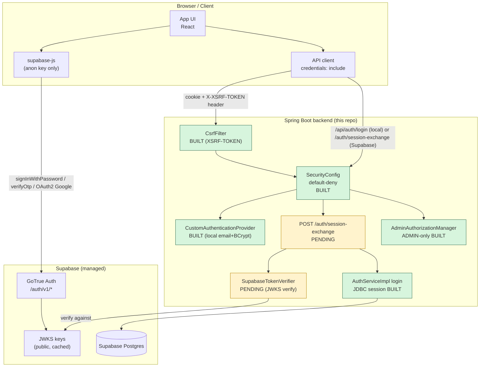
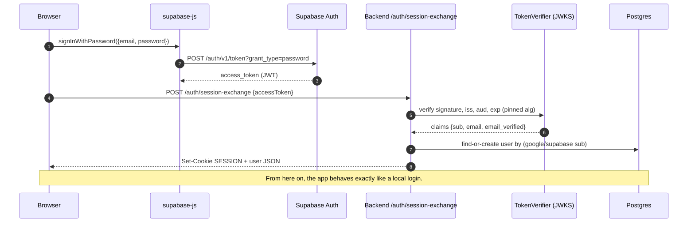
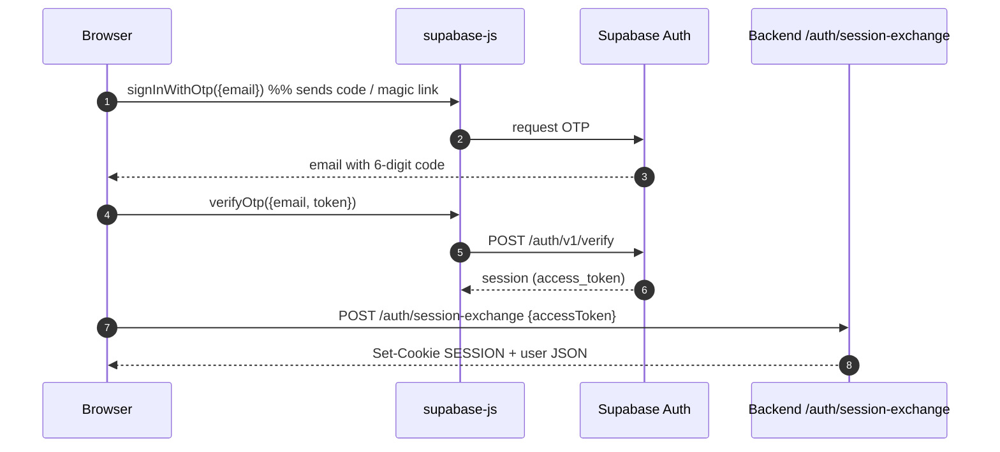
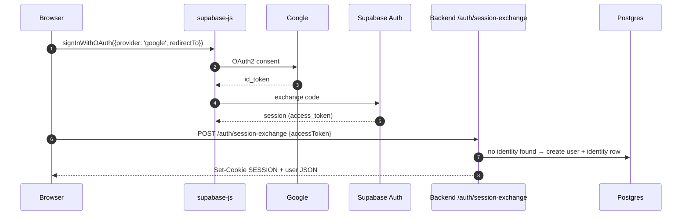
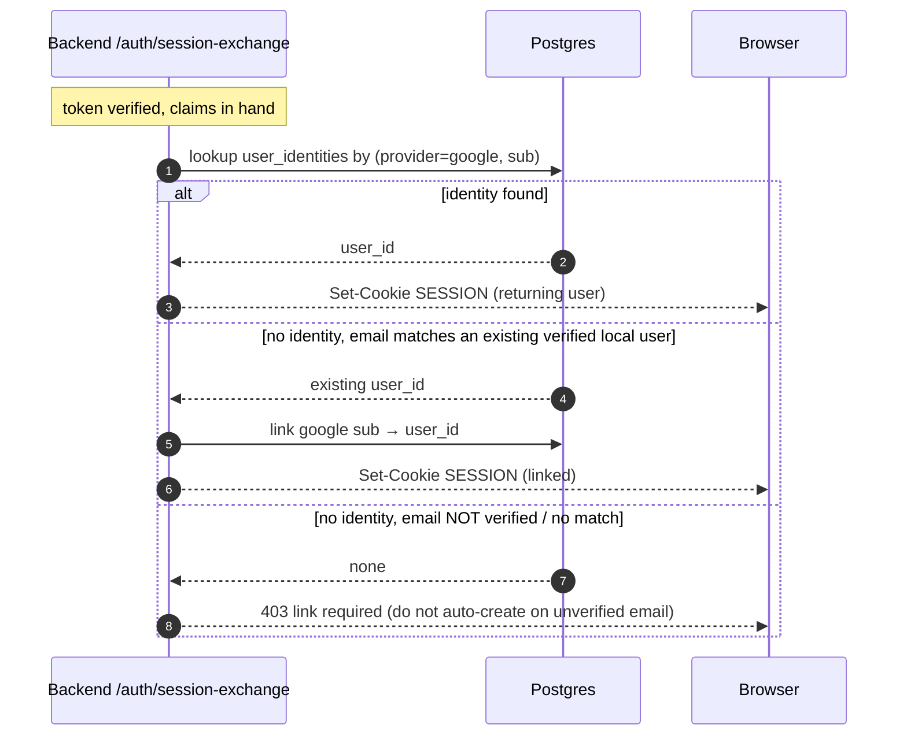

# Authentication Architecture

Visual reference for how sign-in works today and how Supabase (email/password, OTP, Google) will plug in. Diagrams are Mermaid; render them in any Mermaid-capable viewer or GitHub preview.

Legend: **[BUILT]** exists in the repo now · **[PENDING]** designed, not implemented

---

## 1. System overview (target state)

The app keeps its **own session cookie** as the application credential. Supabase is used **only** to prove *who the user is* (issue a verifiable token). The backend verifies that token server-side, then mints a normal `HttpSession` — so every existing controller, matcher, and admin check keeps working unchanged.



Key idea: the browser never hands the app a long-lived Supabase token for API calls. It exchanges it once, then uses the cookie.

### Current security posture

- **Default-deny** — every route is explicitly classified; unmatched requests require authentication.
- **CSRF enabled** — `XSRF-TOKEN` cookie echoed back as `X-XSRF-TOKEN` on writes.
- **Admin is ADMIN-only** — `/api/admin/**`, `/api/v1/data/**`, `/api/v1/widget/**`; a `PROJECT` API key is never sufficient.
- **Persistent sessions** — JDBC-backed, 24h timeout, fixation-safe rotation on login.

Full matcher table in [section 6](#6-current-authorization-model-as-shipped).

---

## 2. Sign-in / sign-up sequence diagrams

### 2a. Local email + password (current, built)

```mermaid
sequenceDiagram
    autonumber
    participant U as Browser
    participant CS as CsrfFilter
    participant AC as AuthControllerImpl
    participant AP as CustomAuthenticationProvider
    participant DB as users (JDBC session)

    Note over U,DB: /api/auth/login is CSRF-exempt (no session exists yet)
    U->>CS: POST /api/auth/login {email, password}
    CS->>AC: pass through
    AC->>AP: ProviderManager.authenticate(email, pw)
    AP->>DB: findByEmail + BCrypt.matches
    DB-->>AP: UUID principal + role authority
    AP-->>AC: authenticated UUID
    AC->>AC: invalidate old session (fixation defense)
    AC->>DB: new session, set USER_ID, save SecurityContext
    AC-->>U: 200 + Set-Cookie SESSION + Set-Cookie XSRF-TOKEN
    Note over U,DB: Subsequent writes MUST send X-XSRF-TOKEN; /api/admin/** needs ADMIN.
```

### 2b. Email + password (Supabase) — PENDING



### 2c. Email OTP (magic code) — PENDING



### 2d. Google SSO, new user — PENDING



### 2e. Google SSO, returning user (account linking) — PENDING



---

## 3. Where each piece is today

| Piece | Status | Notes |
|---|---|---|
| Local email + password sign-in/sign-up | **BUILT** | `POST /api/auth/register`, `/api/auth/login` (BCrypt + session). |
| Logout + current user | **BUILT** | `POST /api/auth/logout`, `GET /api/auth/me`. |
| Session cookie (`SESSION`) | **BUILT** | Set on login; `AuthControllerImpl` invalidates old session first (fixation-safe). |
| Persistent session store | **BUILT** | `spring-boot-starter-session-jdbc` (Boot 4 module) + `SPRING_SESSION` tables via Flyway **V87** in `platform`. 24h timeout is real; verified persisting session rows. |
| CSRF protection | **BUILT** | `CookieCsrfTokenRepository` → `XSRF-TOKEN` cookie + `X-XSRF-TOKEN` header. |
| Default-deny authorization | **BUILT** | `.anyRequest().authenticated()`; every route is explicitly classified. |
| Admin authorization | **BUILT** | `AdminAuthorizationManager`; `/api/admin/**`, `/api/v1/data/**`, `/api/v1/widget/**` are ADMIN-only. |
| Project API-key auth (external clients) | **BUILT** | `X-API-Key` → `ProjectApiKeyAuthFilter` → `PROJECT` authority; cannot reach admin surface. |
| Supabase email/password | **PENDING** | Needs `supabase-js` + `/auth/session-exchange` + `SupabaseTokenVerifier`. |
| Supabase email OTP | **PENDING** | Same as above; `signInWithOtp` + `verifyOtp`. |
| Google SSO (sign-up + sign-in + link) | **PENDING** | Same as above; `signInWithOAuth` + identity table. |
| `user_identities` table | **PENDING** | `(user_id, provider, provider_subject)` keyed; `users.password_hash` becomes nullable. |
| JWKS token verification | **PENDING** | Server-side only; no `jjwt`/Nimbus present today. |
| JWT for the app itself | **NOT PLANNED** | App stays session/cookie based — no user JWT is issued or required. |

---

## 4. API call summary (what the client calls)

| Goal | Client call | Where |
|---|---|---|
| Local sign-in (current) | `POST /api/auth/login` | Backend, **BUILT**, CSRF-exempt |
| Local sign-up (current) | `POST /api/auth/register` | Backend, **BUILT**, CSRF-exempt |
| Who am I | `GET /api/auth/me` | Backend, **BUILT** |
| Sign out | `POST /api/auth/logout` | Backend, **BUILT**, CSRF-exempt |
| Anonymous visitor bootstrap | `POST /api/identity` | Backend, **BUILT**, CSRF-exempt |
| Any state change | `POST`/`PUT`/`PATCH`/`DELETE` | Backend, **requires `X-XSRF-TOKEN`** |
| Supabase password / OTP / Google | Supabase `signInWithPassword` / `verifyOtp` / `signInWithOAuth` | Supabase, **PENDING** |
| Exchange Supabase token → app session | `POST /auth/session-exchange` | Backend, **PENDING** |

The backend is the single place that turns "proven identity" into "an authorized app session." Every downstream endpoint stays exactly as it is today.

---

## 5. Security decisions baked into this design

1. **Token is exchanged, not forwarded.** The Supabase JWT authenticates only the `session-exchange` call; the app then rides on its own `HttpSession`. No Supabase token is stored or reused as an API credential.
2. **Server-side verification is mandatory.** JWKS signature + `iss` + `aud` + `exp`, algorithm pinned, `alg:none`/confusion rejected. Client-supplied claims are never trusted.
3. **Identity keyed by provider subject, not email.** `users.password_hash` becoming nullable and a separate `user_identities` table keep one local user able to hold several external identities.
4. **Link only on a verified email match.** An unverified Google email never auto-creates or auto-links an account (prevents email-domain takeover).
5. **Service-role key stays server-side.** The browser uses only the anon/publishable key.
6. **Supabase-issued sessions use the same CSRF rules.** The `session-exchange` `POST` is not
   auto-exempt; it either carries `X-XSRF-TOKEN` or is exempted by explicit decision, so a new
   auth path cannot silently become a CSRF hole.

---

## 6. Current authorization model (as shipped)

The chain is now **default-deny**. Rules are evaluated top-down, first match wins:

| # | Matcher | Result |
|---|---|---|
| 1 | `/api/auth/register\|login\|logout\|me`, `/api/health` | permitAll |
| 2 | Public reCALL `GET`s (questions, topics, search, queue, bundles, enrich/search) | permitAll |
| 3 | `publicPaths` — `api-access.yaml` PUBLIC rules | permitAll |
| 4 | `/api/recall/**` | authenticated |
| 5 | `userPaths` — notifications, timeline, `/api/auth/profile\|metadata\|level`, `/api/audit/**` | authenticated |
| 6 | `/api/admin/**`, `/api/v1/data/**`, `/api/v1/widget/**` | **ADMIN only** |
| 7 | `projectPaths` — DB PROJECT rules | ADMIN **or** matching `PROJECT` key |
| 8 | `GET` on content / explorer / blog / identity / stars / assets | permitAll |
| 9 | `POST /api/identity` (anonymous visitor bootstrap) | permitAll |
| 10 | everything else | **authenticated** |

Two ordering rules matter and are now load-bearing:

- **`/api/auth/**` must not be permitted as a blanket.** A wildcard permit placed before
  `userPaths` would swallow `/api/auth/profile`, `/metadata` and `/level` and expose them
  unauthenticated. Only the four credential endpoints above are public. This had to be fixed
  in *two* places, not one: `SecurityConfig` now permits only the four endpoints by name, and
  the matching `Auth API /api/auth/**` entry has been **removed** from `api-access.yaml` —
  `publicPaths` (rule 3) is consulted before `userPaths` (rule 5), so leaving the YAML rule
  in place re-opened all four profile routes regardless of the code.
- **`/api/admin/**` is evaluated before `projectPaths`.** Because rule 7 also accepts a
  `PROJECT` authority, placing admin paths after it would let any project API key satisfy
  the admin check. Admin paths must come first and use `adminAuthorizationManager` alone.

### CSRF

Enabled with a cookie-backed token: the server issues a non-HttpOnly `XSRF-TOKEN` cookie
and expects it back in the `X-XSRF-TOKEN` header on `POST`/`PUT`/`PATCH`/`DELETE`. Safe
methods are exempt. Four routes are CSRF-exempt because they are reached before any cookie
can exist: `/api/auth/login`, `/api/auth/register`, `/api/auth/logout`, `POST /api/identity`.

A cookie-based repository is used rather than the session-backed one specifically because
login creates a *new* session, which would invalidate a session-scoped token on the first
authenticated request.

`CsrfFilter` signals rejection by throwing an `AccessDeniedException` subtype, so a bad token
reaches the same `accessDeniedHandler` as a genuine authorization failure. That handler now
branches on `CsrfException` and returns `403 {"error":"Invalid CSRF token"}`; without the
branch a client that simply forgot the header was told it needed admin access.

> This is a **breaking change for clients not updated to the new `api/client.ts`.**
> Unmigrated clients will receive `403` on writes. See `docs/AUTH_INTEGRATION.md`.

---

## 7. Remaining known gaps

**Live DB rule is too broad (needs a data change, not code):**

`api_access_rules` currently contains a `PROJECT` rule for `/api/**` scoped to the
`platform` project key. That grants a `platform` key reach over every `/api/` path. The
code fix above makes `/api/admin/**` ADMIN-only regardless, but the rule itself should be
narrowed to the specific paths that client actually needs.

Also note two rules are now shadowed by the explicit read permits in rule 8 —
`/api/coding-profiles/**` and `/api/content/**` match before `projectPaths` is consulted,
so their PROJECT grants no longer take effect. This is intended; confirm no client depends
on key-based access to them.

**Other (unchanged, unrelated to SSO):**

- No refresh token, password reset, email verification, or MFA. A leaked password is permanent.
- Admin authorization performs an uncached `findById` per request.
- `AuthControllerImpl.recordAudit` swallows all exceptions and trusts `X-Forwarded-For` /
  `Origin` headers, so audit attribution is spoofable.
- `users.deleted_at` (soft delete) is not checked on the authentication path.

---

## 8. Supabase: how it changes this model

Nothing above is invalidated by adding Supabase. The `/auth/session-exchange` endpoint
verifies the Supabase token server-side and then runs the **exact same** session-establishment
code as `AuthControllerImpl.login` — invalidate, create, set `USER_ID`, save `SecurityContext`.
The client receives an ordinary `SESSION` cookie and the CSRF flow is unchanged.

One consequence worth planning for: the Supabase flows issue the session from a `POST` that
is **not** CSRF-exempt, so it must either carry `X-XSRF-TOKEN` or be added to the exempt list
by explicit decision.
