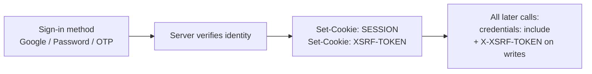

# Client Authentication Guide (Google Sign-In, Email + Password, OTP)

Audience: any frontend / external client integrating with the platform API.
Base URL (dev): `http://localhost:8080` — configure per environment.

**Every sign-in method below converges on the same thing: a `SESSION` cookie.** Once you have
that cookie, all other API calls authenticate the same way. There is no bearer token, no
`Authorization` header, and no SDK.

---

## 1. The one rule that governs everything



| Sign-in method | Endpoint | Status |
|---|---|---|
| Email + password (register) | `POST /api/auth/register` | **Live** |
| Email + password (login) | `POST /api/auth/login` | **Live** |
| Logout | `POST /api/auth/logout` | **Live** |
| Current user | `GET /api/auth/me` | **Live** |
| Google Sign-In (credential) | `POST /api/auth/google` | **Live** |
| OTP (magic code) | `POST /api/auth/otp/request`, `POST /api/auth/otp/verify` | **Live** |

All three methods are shipped and callable. Google sign-in uses **only** the credential flow
(`POST /api/auth/google`) — section 5 explains why the server-redirect flow is not part of the
contract, and what each additional site must configure.

---

## 2. Cookies you will receive

| Cookie | HttpOnly | Purpose |
|---|---|---|
| `SESSION` | yes | Your credential. Sent automatically on every request. |
| `XSRF-TOKEN` | no | Must be read by JS and echoed in the `X-XSRF-TOKEN` header on writes. |

Attributes: `Path=/`, `Max-Age=86400` (24h), `SameSite=None`, `Secure=true`.
Secure means HTTPS only — `http://localhost` is fine because browsers treat it as a secure
context, but any other host must be HTTPS or cookies will be dropped.

Session timeout is 24h and **one active session per user** — signing in elsewhere invalidates
the earlier session. Handle a `401` by redirecting to your login screen, not by retrying.

---

## 3. How all other API calls authenticate

Two requirements, and that is the whole contract:

1. **`credentials: 'include'`** on every request, so the browser sends and stores cookies.
2. **`X-XSRF-TOKEN` header** on `POST`, `PUT`, `PATCH`, `DELETE`, copied from the
   `XSRF-TOKEN` cookie.

Dropping the header on a write returns `403 {"error":"Invalid CSRF token"}`. This is the most
common integration failure — treat 403-with-that-body as "refetch the token and retry once",
not as a permissions problem.

### Drop-in client

```typescript
// apiClient.ts — works for every method below
const API_BASE = (import.meta.env.VITE_API_BASE_URL ?? '').replace(/\/$/, '');

const UNSAFE = new Set(['POST', 'PUT', 'PATCH', 'DELETE']);

function getCookie(name: string): string | undefined {
  const m = document.cookie.match(new RegExp('(?:^|;\\s*)' + name + '=([^;]*)'));
  return m ? decodeURIComponent(m[1]) : undefined;
}

export async function api<T = unknown>(path: string, options: RequestInit = {}): Promise<T> {
  const method = (options.method ?? 'GET').toUpperCase();
  const headers: Record<string, string> = {
    'Content-Type': 'application/json',
    ...(options.headers as Record<string, string>),
  };
  if (UNSAFE.has(method)) {
    const token = getCookie('XSRF-TOKEN');
    if (token) headers['X-XSRF-TOKEN'] = token;
  }

  const res = await fetch(`${API_BASE}${path}`, { ...options, headers, credentials: 'include' });

  if (res.status === 401) {
    // Session expired or never existed — send the user back to sign-in.
    window.dispatchEvent(new CustomEvent('auth:unauthorized'));
    throw new Error('Not authenticated');
  }
  if (!res.ok) {
    const body = await res.json().catch(() => ({}));
    throw Object.assign(new Error(body.error ?? `HTTP ${res.status}`), { status: res.status, body });
  }
  return res.json() as Promise<T>;
}
```

### Axios equivalent

```typescript
axios.defaults.withCredentials = true;
axios.interceptors.request.use((config) => {
  const m = (config.method ?? 'get').toUpperCase();
  if (['POST', 'PUT', 'PATCH', 'DELETE'].includes(m)) {
    config.headers['X-XSRF-TOKEN'] = getCookie('XSRF-TOKEN') ?? '';
  }
  return config;
});
```

### Checking auth on app load

```typescript
const me = await api<{ id: string; email: string; name: string; role: string }>('/api/auth/me');
// 200 -> signed in. 401 -> show the sign-in screen.
```

`role` is `USER` or `ADMIN`. Admin-only routes (`/api/admin/**`, `/api/v1/data/**`,
`api/v1/widget/**`) reject non-admins with `403` regardless of any API key.

### Server-to-server calls (no browser)

Cookies do not exist outside a browser. Keep a cookie jar and send cookies manually:

```bash
curl -c jar.txt -X POST http://localhost:8080/api/auth/login \
  -H 'Content-Type: application/json' \
  -d '{"email":"user@example.com","password":"secret123"}'

# token comes back in the XSRF-TOKEN cookie
TOKEN=$(grep XSRF-TOKEN jar.txt | awk '{print $7}')

curl -b jar.txt http://localhost:8080/api/auth/me

curl -b jar.txt -X POST http://localhost:8080/api/auth/logout \
  -H "X-XSRF-TOKEN: $TOKEN"
```

---

## 4. Email + password (live)

### Register — `POST /api/auth/register`

```json
{ "email": "user@example.com", "password": "secret123", "name": "User Name" }
```

| Status | Body | Meaning |
|---|---|---|
| `201` | `{ id, email, name, role }` | Created. `SESSION` cookie is set — user is already signed in. |
| `400` | `{ error, hint }` | Validation failed. |
| `409` | `{ "error": "Email already exists" }` | Duplicate email. |

Validation: `email` valid and ≤ 255 chars, `password` between 8 and 72 chars, `name` required
and ≤ 255 chars.

### Login — `POST /api/auth/login`

```json
{ "email": "user@example.com", "password": "secret123" }
```

| Status | Body | Meaning |
|---|---|---|
| `200` | `{ id, email, name, role }` | Signed in; `SESSION` + `XSRF-TOKEN` set. |
| `400` | `{ error, hint }` | Malformed body. |
| `401` | `{ "error": "Invalid email or password" }` | Wrong credentials. |

Both endpoints are CSRF-exempt (no session exists yet when they are first called).

### Logout — `POST /api/auth/logout`

`200 { "message": "Logged out successfully" }`. Server invalidates the session; clear local
user state and redirect. Also CSRF-exempt.

---

## 5. OTP / magic code (planned contract)

Two calls. The code arrives by email; it is exchanged for a normal session.

### 5a. Request a code — `POST /api/auth/otp/request`

```json
{ "email": "user@example.com" }
```

`200 { "message": "If an account exists for that email, a code has been sent." }`

Always returns 200, whether or not the account exists — do not branch on the response to
reveal registered emails.

- Code is 6 digits, expires in **10 minutes**.
- Resend is rate-limited to 1 request / 30s per email and 5 per hour per email.
- Maximum 5 verification attempts per code, then the code is invalidated.

### 5b. Verify the code — `POST /api/auth/otp/verify`

```json
{ "email": "user@example.com", "code": "123456" }
```

| Status | Body | Meaning |
|---|---|---|
| `200` | `{ id, email, name, role }` | Signed in; `SESSION` + `XSRF-TOKEN` set. |
| `400` | `{ "error": "Invalid or expired code" }` | Wrong code, expired, or attempts exhausted. |
| `429` | `{ "error": "Too many attempts" }` | Back off, do not auto-retry. |

Unknown email with a correct code returns the same `400` — this avoids account enumeration.

**CSRF note:** `/otp/verify` is reached before any cookie exists, so it will be CSRF-exempt
like `/api/auth/login`. If your reads of the `XSRF-TOKEN` cookie are empty on this call, that
is expected; do not block the request on a missing token.

### 5c. Optional: set a password after OTP sign-in

A user who signed in via OTP has no password. If you want them to be able to use email +
password later:

```json
POST /api/auth/password
{ "newPassword": "at-least-8-chars" }
```

Requires an authenticated session (send `credentials: 'include'` + `X-XSRF-TOKEN`).

---

## 6. Google Sign-In

Use Google's own button and token library in the browser; **never** put a Google client secret
in frontend code. The flow:

1. Render the Google button (Google Identity Services, `renderButton`, or the
   `<div class="g_id_onload">` FedCM variant).
2. On credential callback, receive a Google ID token (JWT).
3. Send that token to the platform, which verifies it **server-side** against Google's public
   keys and mints the same `SESSION` cookie every other method returns.

**Use this credential flow from every site.** It is origin-agnostic — the backend verifies a
signed token and never inspects which site sent it — so any number of sites share the single
`POST /api/auth/google` endpoint.

`POST /api/auth/google` is the **only** Google sign-in entry point. The earlier
server-redirect endpoints (`GET /api/auth/google` and `GET /api/auth/google/callback`) have
been removed — they were single-origin by construction and could never complete a sign-in. If
you are following an older copy of this guide, ignore its redirect-flow section.

**Checklist for each additional site**

1. **Reuse the existing Web OAuth client** — do not create a new one. Copy the same client id
   the other sites use.
2. Add that site's origin to that client's **Authorized JavaScript origins**. One client can
   carry many origins. No redirect URI is needed for the credential flow.
3. Expose the same client id to the browser as `VITE_GOOGLE_CLIENT_ID`. Never ship a client
   secret.
4. Ask the platform owner to add the site's origin to the backend CORS allowlist. Without it
   the browser blocks the response even though the request reached the server.

**Constraint — this is stricter than it looks.** The backend accepts a token only if its `aud`
claim contains the one configured client id, compared as an exact string
(`GoogleTokenVerifierImpl.java:61-62`). So every site must use the **identical client id**, not
merely a client from the same Google Cloud project. Two different Web clients in one project
still produce two different `aud` values, and the second site's tokens are rejected with
`400 Invalid Google credential`.

**If your site genuinely needs its own client id**, the platform owner must first change the
backend to accept a set of client ids and configure them as a comma-separated list. Until that
lands, a per-site client id will not work.


### 6a. Client setup (Google Cloud Console)

1. Google Cloud Console → **APIs & Services** → **Credentials**.
2. **Create credentials** → **OAuth client ID** → **Web application**.
3. **Authorized JavaScript origins** — add every origin you serve from. Exact scheme + host
   + port, no path, no trailing slash:
   - `http://localhost:5173`
   - `https://app.yourdomain.com`
4. Copy the **Client ID**. The **Client secret** is backend-only and is never used by the
   browser.

The platform backend needs only `GOOGLE_CLIENT_ID` for this flow — it verifies tokens against
Google's public JWKS and never calls the token endpoint, so no client secret is involved.

### 6b. Load the library

```html
<script src="https://accounts.google.com/gsi/client" async defer></script>
```

### 6c. Render the button

```html
<div id="google-signin"></div>
```

```javascript
google.accounts.id.initialize({
  client_id: import.meta.env.VITE_GOOGLE_CLIENT_ID,
  callback: handleGoogleCredential,
  ux_mode: 'popup',
});

google.accounts.id.renderButton(document.getElementById('google-signin'), {
  theme: 'outline_black',
  size: 'large',
  text: 'continue_with',
  width: 320,
});
```

**Optional request fields:**

| Field | Purpose |
|---|---|
| `hd` | Hosted-domain hint, e.g. `yourdomain.com`. Send it for analytics/UX only. It can **narrow** the server's allowlist but never widen it — a client cannot grant itself access by setting this. |
| `inviteCode` | Required only if the platform has `GOOGLE_INVITE_CODES` set. |

### 6d. Exchange the Google token — `POST /api/auth/google`

`POST /api/auth/google` is **CSRF-exempt** (same as `/api/auth/login`), so no `X-XSRF-TOKEN`
header is needed on this call.

```javascript
async function handleGoogleCredential(response: { credential: string }) {
  const res = await fetch(`${API_BASE}/api/auth/google`, {
    method: 'POST',
    headers: { 'Content-Type': 'application/json' },
    credentials: 'include',
    body: JSON.stringify({ credential: response.credential }),
  });
  if (!res.ok) throw new Error((await res.json()).error ?? 'Google sign-in failed');
  const user = await res.json();
  // session is established — from here on use api() like any other call
}
```

Request body:

| Field | Type | Required | Notes |
|---|---|---|---|
| `credential` | string | yes | The Google ID token (`response.credential`). Max 4096 chars. |
| `hd` | string | no | Hosted domain hint, e.g. `yourdomain.com`. Max 255 chars. |
| `inviteCode` | string | no | Invite/waitlist code, if you gate signup. Max 100 chars. |

**`200` response body** — the same shape as `GET /api/auth/me`, so one type covers every
sign-in method:

```json
{
  "id": "0f9c1e2a-...",
  "email": "person@example.com",
  "name": "Person",
  "role": "user",
  "level": "free",
  "metadata": {},
  "phone": null,
  "emailVerified": true,
  "phoneVerified": false
}
```

`phone` is omitted when absent. There is no `avatarUrl` — the platform does not store or return
a profile image.

On `200` the server sets `SESSION` + `XSRF-TOKEN`. Because the session cookie is
`SameSite=None; Secure`, the site **must** be served over HTTPS (localhost is exempt) or the
browser will silently drop the cookie and every later call will return `401`.

Error responses — every error body is `{ "error": string, "hint": string | null }`:

| Status | `error` | Meaning | Client action |
|---|---|---|---|
| `400` | `Validation failed` | `credential` blank/absent or over-length. | Bug in your integration. |
| `400` | `Invalid Google credential` | Token expired, wrong client id (audience mismatch), or bad signature. | Re-prompt; do not retry the same token. |
| `403` | `Account link required` | Google email matches an existing account but Google did not assert it as verified. `hint` carries the explanation. | Show the linking prompt (6e). **There is no `email` field in this body.** |
| `403` | `Email not allowed` | Domain not on the allowlist, or invite code invalid. `hint` says which. | Show `hint`; this is not retryable. |
| `503` | `Google sign-in is not configured` | The backend has no `GOOGLE_CLIENT_ID`. | Server-side misconfiguration — surface a generic failure, do not retry. |

This endpoint returns **no `409`** and has **no rate limit** (`429`). A `409 Email already
exists` belongs to `/api/auth/register` only.

### 6e. Account linking — the case to design for

A user may already have an account with the same email. The server decides in this order:

1. **Known Google identity** (`provider` + Google's `sub` already linked) → `200`, same user.
2. **Email not on file** → a new account is created, `emailVerified` set to `true`, Google
   identity linked → `200`.
3. **Email on file and Google asserts `email_verified: true`** → the Google identity is linked
   to that existing account, same user id returned → `200`.
4. **Email on file but Google does *not* assert it verified** → `403 Account link required`.
   The server refuses to attach an external credential to a pre-existing account on an
   unverified address, because anyone who could register that address elsewhere could then
   claim the account. Ask the user to sign in with their existing method and link from account
   settings.

Design the `403` prompt up front. Treating it as a generic error is the most common way this
integration ships broken for existing users.

### 6f. Environment variable

```
VITE_GOOGLE_CLIENT_ID=1234567890-abc.apps.googleusercontent.com
```

Never ship a client secret to the browser. Never treat a successful Google popup on the client
as proof of identity — only the `200` from `POST /api/auth/google` establishes a session.

### 6g. Complete working example

Everything a React + Vite site needs, end to end. Framework-agnostic logic is the same for any
stack; only the component wrapper changes.

**1. `index.html`** — load the Google library once.

```html
<script src="https://accounts.google.com/gsi/client" async defer></script>
```

**2. `.env`**

```
VITE_API_BASE_URL=https://api.yourdomain.com
VITE_GOOGLE_CLIENT_ID=1234567890-abc.apps.googleusercontent.com
```

**3. `googleAuth.ts`** — the whole integration, no UI.

```typescript
const API_BASE = import.meta.env.VITE_API_BASE_URL;
const CLIENT_ID = import.meta.env.VITE_GOOGLE_CLIENT_ID;

export type PlatformUser = {
  id: string;
  email: string;
  name: string;
  role: string;
  level: string;
  metadata: Record<string, unknown>;
  phone?: string;
  emailVerified: boolean;
  phoneVerified: boolean;
};

export class GoogleAuthError extends Error {
  constructor(
    readonly status: number,
    readonly code: string,
    readonly hint: string | null,
  ) {
    super(code);
  }
  /** True when the user must sign in with their existing password to link Google. */
  get needsLinking() {
    return this.status === 403 && this.code === 'Account link required';
  }
}

let scriptPromise: Promise<void> | null = null;

/** Loads accounts.google.com/gsi/client once and resolves when `google.accounts.id` is ready. */
function loadGsi(): Promise<void> {
  if (window.google?.accounts?.id) return Promise.resolve();
  if (!scriptPromise) {
    scriptPromise = new Promise((resolve, reject) => {
      const w = window as any;
      w.__gsiReady = () => resolve();
      const s = document.createElement('script');
      s.src = 'https://accounts.google.com/gsi/client';
      s.async = true;
      s.defer = true;
      s.onerror = () => {
        scriptPromise = null;
        reject(new Error('Failed to load Google Identity Services'));
      };
      document.head.appendChild(s);
    });
  }
  return scriptPromise;
}

async function post(res: Response): Promise<PlatformUser> {
  const body = await res.json().catch(() => ({}));
  if (!res.ok) {
    throw new GoogleAuthError(res.status, body.error ?? 'Google sign-in failed', body.hint ?? null);
  }
  return body as PlatformUser;
}

/** Exchanges the Google ID token for a platform session. CSRF-exempt, so no X-XSRF-TOKEN. */
export async function signInWithGoogleCredential(credential: string): Promise<PlatformUser> {
  const res = await fetch(`${API_BASE}/api/auth/google`, {
    method: 'POST',
    headers: { 'Content-Type': 'application/json' },
    credentials: 'include', // required: the SESSION cookie is set here
    body: JSON.stringify({ credential }),
  });
  return post(res);
}

/** Resolves the current session on app load. Returns null when signed out. */
export async function fetchMe(): Promise<PlatformUser | null> {
  const res = await fetch(`${API_BASE}/api/auth/me`, { credentials: 'include' });
  if (res.status === 401) return null;
  if (!res.ok) throw new GoogleAuthError(res.status, 'Could not load profile', null);
  return (await res.json()) as PlatformUser;
}

/** Mounts a Google button into `el`. Returns a cleanup function. */
export async function mountGoogleButton(
  el: HTMLElement,
  onSuccess: (user: PlatformUser) => void,
  onError: (err: GoogleAuthError | Error) => void,
): Promise<() => void> {
  await loadGsi();
  const g = (window as any).google.accounts.id;
  g.initialize({
    client_id: CLIENT_ID,
    ux_mode: 'popup',
    callback: async (r: { credential: string }) => {
      try {
        onSuccess(await signInWithGoogleCredential(r.credential));
      } catch (e) {
        onError(e as GoogleAuthError);
      }
    },
  });
  g.renderButton(el, { theme: 'outline_black', size: 'large', text: 'continue_with', width: 320 });
  return () => el.replaceChildren();
}
```

**4. `GoogleSignInButton.tsx`**

```tsx
import { useEffect, useRef, useState } from 'react';
import { mountGoogleButton, GoogleAuthError, type PlatformUser } from './googleAuth';

export function GoogleSignInButton({ onSignedIn }: { onSignedIn: (u: PlatformUser) => void }) {
  const ref = useRef<HTMLDivElement>(null);
  const [error, setError] = useState<string | null>(null);
  const [needsLink, setNeedsLink] = useState(false);

  useEffect(() => {
    if (!ref.current) return;
    let cleanup: (() => void) | undefined;
    mountGoogleButton(
      ref.current,
      (user) => {
        setError(null);
        setNeedsLink(false);
        onSignedIn(user);
      },
      (err) => {
        if (err instanceof GoogleAuthError) {
          setNeedsLink(err.needsLinking);
          // Prefer `hint` — it explains the actual cause; `error` is a stable code.
          setError(err.hint ?? err.code);
        } else {
          setError('Google sign-in failed. Please try again.');
        }
      },
    ).then((fn) => (cleanup = fn));
    return () => cleanup?.();
  }, [onSignedIn]);

  return (
    <div>
      <div ref={ref} />
      {needsLink && (
        <p>
          An account already uses this email.{' '}
          <a href="/signin">Sign in with your existing method</a> to link Google.
        </p>
      )}
      {error && !needsLink && <p role="alert">{error}</p>}
    </div>
  );
}
```

**5. On app load** — resolve the session before rendering anything auth-gated, so a refresh
does not bounce the user to the sign-in screen.

```typescript
const [user, setUser] = useState<PlatformUser | null | 'loading'>('loading');
useEffect(() => {
  fetchMe().then(setUser).catch(() => setUser(null));
}, []);
if (user === 'loading') return <Splash />;
```

**Troubleshooting**

| Symptom | Cause |
|---|---|
| Button never renders | `VITE_GOOGLE_CLIENT_ID` missing, or the GSI script was blocked. |
| `Failed to fetch` / CORS error in console | Site origin not in the backend CORS allowlist. |
| `origin_mismatch` from Google | Origin missing from **Authorized JavaScript origins**. |
| `400 Invalid Google credential` | This site's client id differs from the one the backend accepts, or the token was reused/expired. |
| Signs in then every call is `401` | Site is not HTTPS, so the browser dropped the `Secure` session cookie. |
| `503 Google sign-in is not configured` | Backend has no `GOOGLE_CLIENT_ID` — platform-side fix. |
---

## 7. Errors you will see

| Status | Body | What to do |
|---|---|---|
| `400` | `{ error, hint }` | Show `hint` inline next to the field. |
| `401` | `{ "error": "Invalid email or password" }` / `{ "error": "Not authenticated" }` | Invalid credentials, or session expired → sign-in screen. |
| `403` | `{ "error": "Invalid CSRF token" }` | Read `XSRF-TOKEN` again, retry once. If it repeats, the cookie is being blocked — check HTTPS. |
| `403` | `{ "error": "Account link required", hint }` | Prompt the user to link (section 6e). No `email` field is returned. |
| `403` | `{ "error": "Email not allowed", hint }` | Domain/invite rejected. Show `hint`; not retryable. |
| `409` | `{ "error": "Email already exists" }` | `/api/auth/register` only — offer sign-in instead of sign-up. |
| `429` | `{ "error": "Too many attempts" }` | OTP verify/resend only. Back off; do not auto-retry. |
| `503` | `{ "error": "Google sign-in is not configured" }` | Backend misconfiguration. Surface a generic failure. |

---

## 8. Integration checklist

- [ ] `credentials: 'include'` on every request to the platform.
- [ ] `X-XSRF-TOKEN` header on all `POST`/`PUT`/`PATCH`/`DELETE` — except the CSRF-exempt
      sign-in endpoints (`/api/auth/login`, `/api/auth/register`, `/api/auth/google`,
      `/api/auth/otp/*`), which need none.
- [ ] Site served over HTTPS (localhost is exempt). The `SESSION` cookie is
      `SameSite=None; Secure`, so a plain-HTTP site silently loses its session.
- [ ] `GET /api/auth/me` on app load to resolve signed-in state; do not rely on cached user data alone.
- [ ] A global `401` handler that redirects to sign-in.
- [ ] Site origin added to **Authorized JavaScript origins** in Google Cloud Console, exactly
      as typed (scheme + host + port, no trailing slash). No redirect URI is needed.
- [ ] Site origin added to the backend CORS allowlist by the platform owner.
- [ ] `VITE_GOOGLE_CLIENT_ID` set; no client secret in the bundle.
- [ ] Account-linking prompt designed for the `403 Account link required` case.
- [ ] OTP resend throttled in the UI (1 per 30s) to match the server limit.

Related: [AUTH_INTEGRATION.md](AUTH_INTEGRATION.md) (API reference),
[AUTH_ARCHITECTURE.md](AUTH_ARCHITECTURE.md) (internal design, not required reading).
